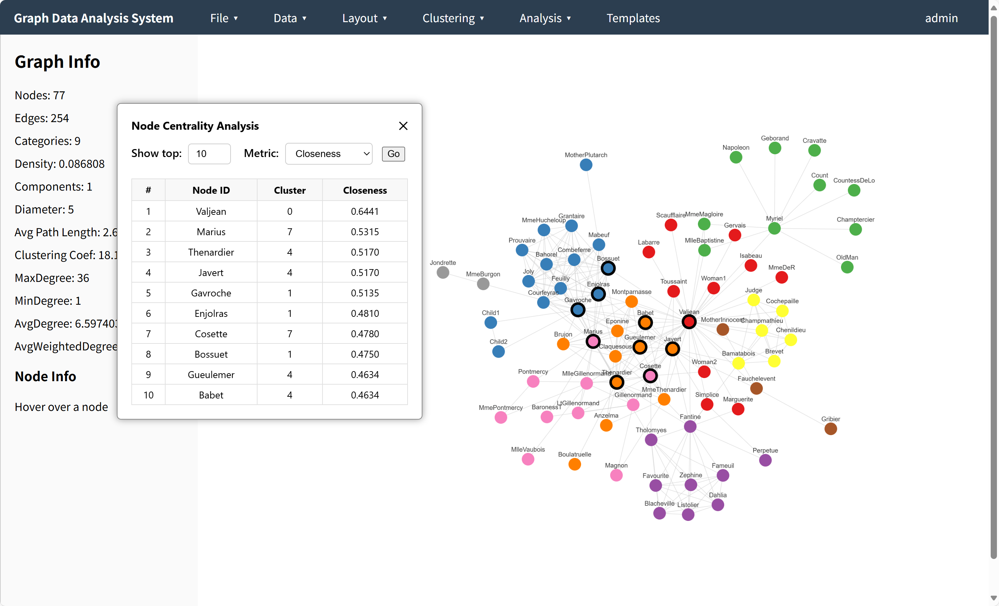

# Graph Data Analysis System

A lightweight, web-based platform for **interactive graph visualization and analysis**.  
It supports graph uploads, clustering (KMeans with Node2Vec, Louvain, Chinese Whispers), centrality analysis (PageRank, Degree, Closeness, Betweenness), and rich front-end interactions based on **Flask + Cytoscape.js**.



More screenshots can be seen in [Demo.pdf](docs/demo.pdf).

---

## Features

- **Graph Data Upload**: Upload JSON-formatted graphs and render instantly.
- **Multiple Layouts**: Force-directed, circular, hierarchical, grid, and random layouts.
- **Clustering Algorithms**:
  - KMeans (Node2Vec embeddings)
  - Louvain
  - Chinese Whispers
- **Node Centrality Analysis**:
  - PageRank
  - Degree
  - Closeness
  - Betweenness
- **Graph Metrics**: Diameter, density, clustering coefficient, connected components, etc.
- **Interactive Functions**:
  - Click / hover node info
  - Node & edge filtering
  - Save and load history records
  - Download images and graph data

---

## Requirements

### Python
- Python 3.8+
- Flask
- NetworkX
- Scikit-learn
- NumPy
- Pandas
- node2vec

Install dependencies:
```bash
pip install -r requirements.txt
````

### Frontend

The system uses the following JS/CSS libraries (already linked via CDN in HTML):

* Cytoscape.js
* Cytoscape-fcose, Cytoscape-cise
* Chart.js
* Bootstrap Icons

---

## Project Structure

```
.
├── app.py                  # Flask backend
├── templates/
│   ├── index.html          # Main graph UI
│   └── login.html          # Login/Register page
├── static/
│   ├── css/
│   │   ├── style.css       # Main page styles
│   │   └── login.css       # Login/Register styles
│   ├── js/
│   │   ├── main.js         # Graph UI logic
│   │   └── login.js        # Login/Register logic
├── requirements.txt
└── README.md
└── docs/
    └── demo.png            # Screenshot of the running system
    └── demo.pdf            # Full screenshots of the running system
    └── init_db.sql         # SQL file of creating database and tables
```

---

## Tutorial

### 1. Clone the Repository

```bash
git clone https://github.com/yourusername/graph-data-analysis-system.git
cd graph-data-analysis-system
```

### 2. Install Python Dependencies

```bash
pip install -r requirements.txt
```

### 3. Run the Backend

```bash
python app.py
```

The server will start at:

```
http://127.0.0.1:5000
```

### 4. Access the UI

* Open your browser and go to `http://127.0.0.1:5000`
* Register an account or log in or enter as a visitor
* Upload your JSON graph or load a template

### 5. Database Configuration
This system requires a MySQL database for storing:
- User accounts
- Uploaded graph records
- Predefined graph templates

#### Step 1: Create the database & tables
Run the SQL script in `docs/init_db.sql`:
```bash
mysql -u root -p < docs/init_db.sql
```

#### Step 2: Update database credentials
In app.py, update:
```SQL
DB_HOST = "localhost"
DB_USER = "root"
DB_PASSWORD = "yourpassword"
DB_NAME = "flask"
```
Once the database is set up, you can start the backend normally.


---
## JSON Graph Format

Example:

```json
{
  "nodes": [
    { "data": { "id": "1", "label": "Node 1" } },
    { "data": { "id": "2", "label": "Node 2" } }
  ],
  "edges": [
    { "data": { "source": "1", "target": "2", "weight": 1 } }
  ]
}
```

---

## License

This project is released under the MIT License. You are free to use, modify, and distribute it.

---

## Contribution

Pull requests are welcome. If you find any bugs or want to add new features, please open an issue or PR.

---


